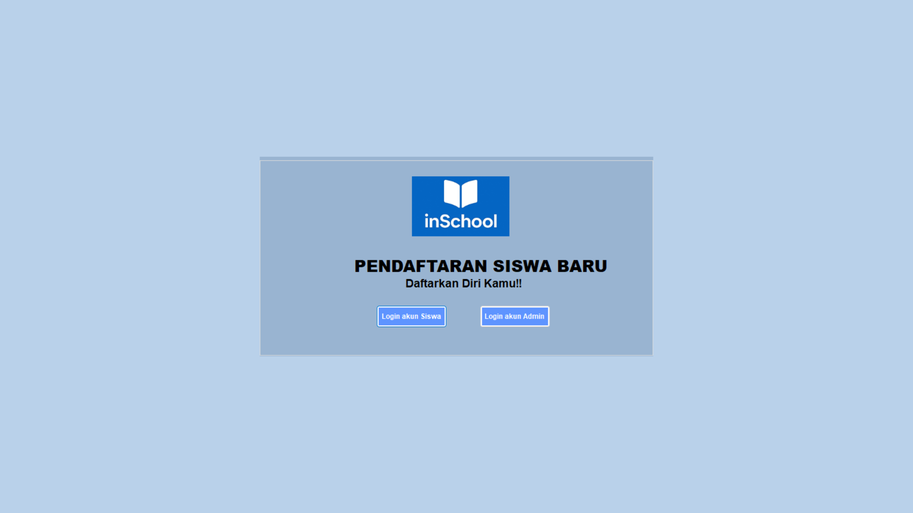
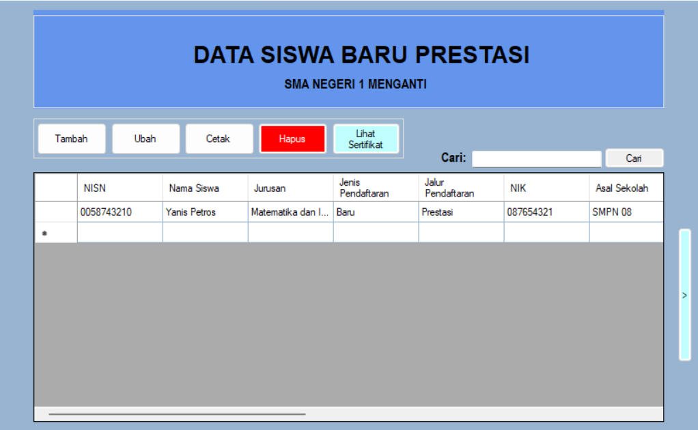
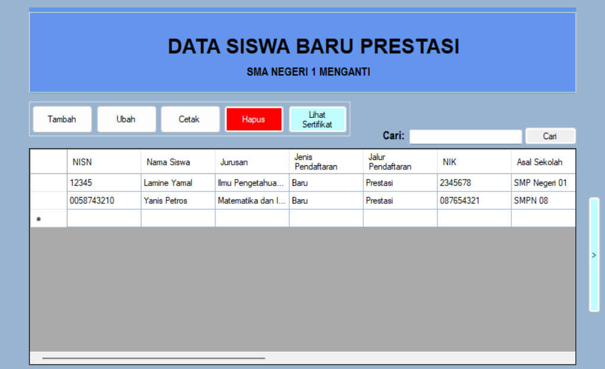
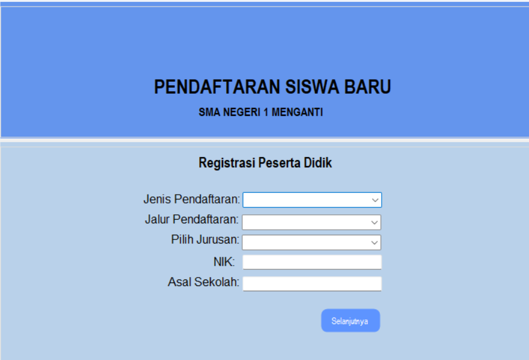
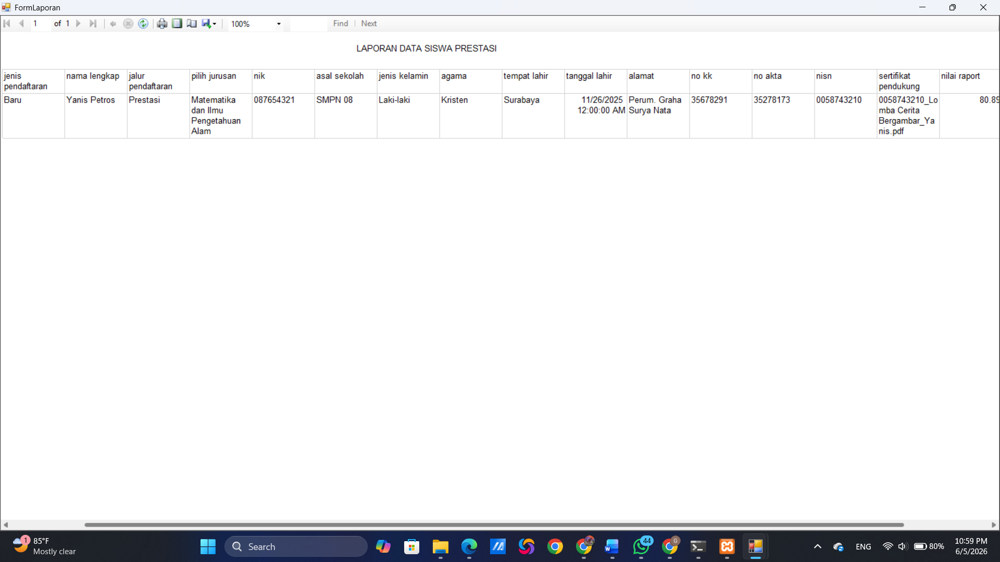

# PPDB (InSchool)

Aplikasi Penerimaan Peserta Didik Baru (PPDB) berbasis desktop yang dikembangkan menggunakan VB.NET Windows Forms dan database SQL untuk membantu proses pendaftaran serta pengelolaan data calon siswa.

## Fitur Utama

- Login Pengguna
- Pendaftaran Calon Siswa
- Pengelolaan Data Siswa
- Pencarian Data Siswa
- CRUD Data Siswa
- Pembuatan Laporan
- Integrasi Database
- Cetak Laporan Menggunakan RDLC Report

## Teknologi yang Digunakan

- VB.NET
- Windows Forms
- SQL Database
- Visual Studio
- RDLC Report

## Tampilan Aplikasi

### Halaman Login



### Dashboard



### Data Siswa



### Form Pendaftaran



### Laporan



## Struktur Project

```text
WindowsApp1
├── My Project
├── Resources
├── Dataset
├── Form Login
├── Form Dashboard
├── Form Data Siswa
├── Form Laporan
├── Module Koneksi
└── Database
```

## Tujuan Pengembangan

Aplikasi ini dibuat untuk membantu proses Penerimaan Peserta Didik Baru (PPDB) agar lebih terstruktur, cepat, dan efisien dalam pengelolaan data calon siswa.

## Pengembang

**Gilang Raga Yudistira**

Mahasiswa S1 Pendidikan Teknologi Informasi  
Universitas Negeri Surabaya (UNESA)

## Repository

GitHub: https://github.com/gilang-raga/PPDB-InSchool
